# 操作手冊 — Alarm-Alpaca 觸控機

對象：每天實際操作這台機器的人（重設按鈕、重新連 WiFi、檢查昨晚那次按鈕有沒有真的撥出電話的人）。

本說明只描述觸控螢幕上做得到的事。不需要筆電、不需要 SSH、不需要打指令。

## 主頁

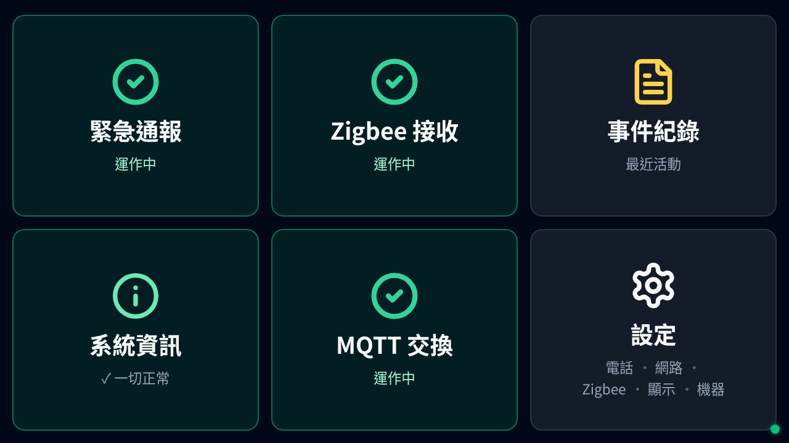

| 磚塊          | 代表的東西                                            | 點下去                |
| ------------- | ----------------------------------------------------- | --------------------- |
| `緊急通報`    | alarm-bridge 程式，負責把按鈕事件轉成電話 + Discord。 | 進入服務細節頁。      |
| `Zigbee 接收` | zigbee2mqtt 容器，跟按鈕用無線通訊。                  | 進入服務細節頁。      |
| `事件紀錄`    | 按鈕按下紀錄、撥出電話紀錄、自我測試紀錄。            | 開啟事件紀錄頁。      |
| `系統資訊`    | 機器健康狀態（運行時間、IP、溫度、風扇、版本）。      | 開啟系統資訊頁。      |
| `MQTT 交換`   | mosquitto 容器，夾在 Zigbee 和 alarm-bridge 中間。    | 進入服務細節頁。      |
| `設定`        | 電話號碼、Zigbee 配對、顯示、WiFi、開關機。           | 開啟設定選單。        |

綠色磚塊顯示 `運作中` 表示服務正常。若磚塊變紅或變黃，點進去就會看到日誌和重啟按鈕。

右下角的綠色小圓點是後端連線狀態指示：綠點 = 後端已連線（畫面即時更新中），黃色閃爍 + `連線中` = 正在重連，紅色 + `後端離線` = 完全斷線。每個頁面都會顯示。正常使用時是綠點、不需要操作；若出現紅色離線，代表畫面顯示的資料已經不是即時的——等幾秒看會不會恢復，不恢復就回報。

## 系統資訊

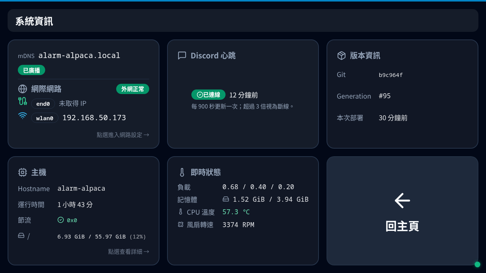

回答「這台機器現在健康嗎？」的單一頁面。

- `mDNS` — 內部狀態指示，一般使用者可以忽略。（本機 Web UI 鎖在 loopback、區網看不到，所以即使這格顯示 `已廣播`，從手機/筆電也連不進來。）
- `網際網路` — 哪一個介面有對外連線。綠色的 `外網正常` 徽章表示機器可以連到外面（TCP 測試 8.8.8.8）。紅色的 `外網不通` 表示連不到外面，先檢查 WiFi/網路線。`未取得 IP` 通常代表網路線沒插或 WiFi 沒接上。
- `Discord 心跳` — 最近一次成功送到 Discord 的心跳訊息。正常會每 15 分鐘更新一次。若顯示 `已斷線` 超過一個小時，代表這台機器**連不到 Discord**；可能是這台機器沒網路、Discord 服務本身有問題、或網路擋住 Discord。先檢查 WiFi；WiFi 正常但這格還是斷線就需要回報（回報時拍下這個畫面）。
- `版本資訊` — git commit、NixOS generation、建置時間。
- `主機` — 運行時間、磁碟用量、CPU 節流計數（`節流` 應該維持 `0x0`；若不是，代表發生過高溫或電壓不足事件）。
- `即時狀態` — CPU 溫度跟風扇轉速。本機正常不會超過 65 °C，超過的話畫面會自動警告。

右下角 `回主頁` 回到主畫面。所有子頁面都會在該位置放返回鍵。

## 事件紀錄

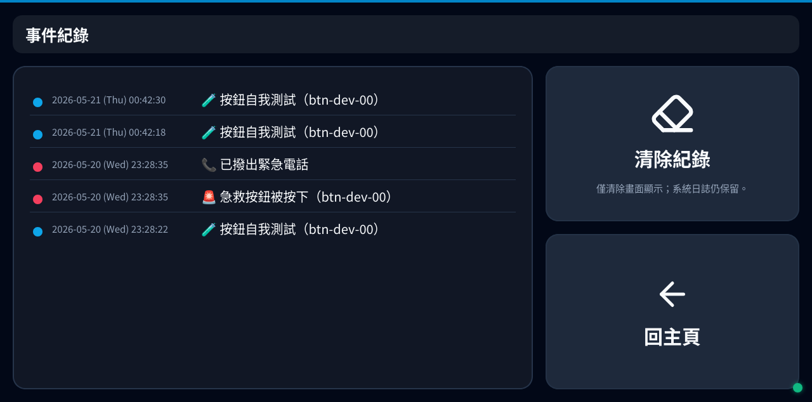

由新到舊列出所有警報事件。

- 紅色圓點 + `急救按鈕被按下` — 真實的按鈕按下事件。
- 紅色圓點 + `已撥出緊急電話` — 緊急電話實際撥出（通常會緊接在上面那一筆「按下」之後）。
- 藍色圓點 + `按鈕自我測試` — 自我測試（例如每週的按鈕檢查）。

`清除紀錄` 只會清掉畫面上顯示的這一份；系統日誌仍然保留，事後仍可從系統日誌還原。

## 服務細節（`緊急通報` / `Zigbee 接收` / `MQTT 交換`）

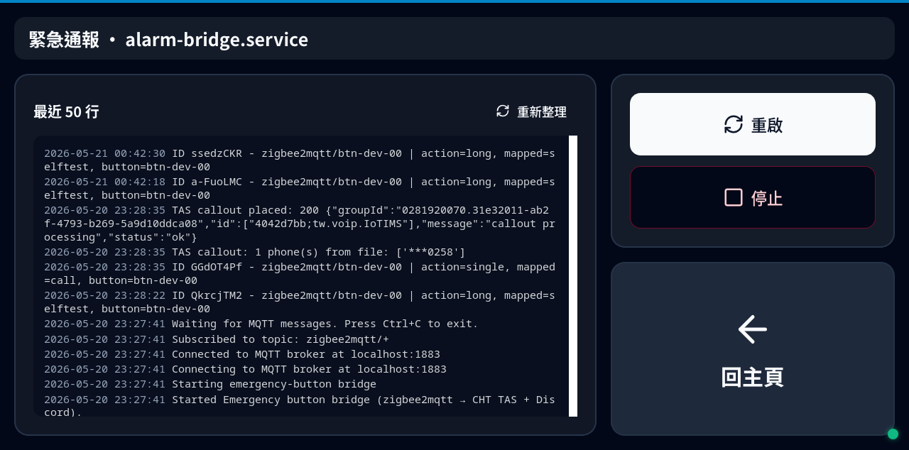

左邊是該服務的最近 50 行日誌；右邊是操作按鈕。

- `重啟` — 重啟服務。主頁出現紅磚塊、或一顆原本正常的按鈕沒反應時，先試這個。
- `停止` — 停止服務。**一般使用者很少需要動**；停掉 `緊急通報` 之後，下一次按按鈕將不會撥出電話。點之前要再確認一次。

紅色字是錯誤、黃色字是警告。**黃字通常不用擔心**，只要主頁該服務的磚塊是綠色就 OK。看不懂內容時，回報時拍下這個畫面。

## 設定

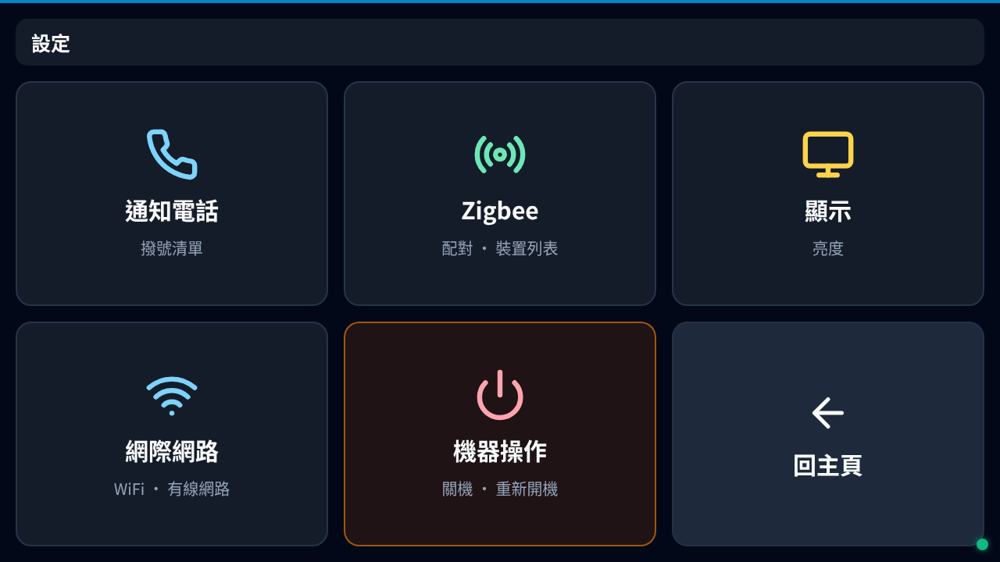

| 磚塊         | 用途                                                     |
| ------------ | -------------------------------------------------------- |
| `通知電話`   | 管理「按下按鈕時要撥的電話號碼清單」。                   |
| `Zigbee`     | 配對新按鈕、查看已配對裝置。                             |
| `顯示`       | 螢幕亮度。                                               |
| `網際網路`   | WiFi 跟有線網路狀態、掃描並加入新網路。                  |
| `機器操作`   | 重新開機、關機、自我測試。                               |
| `回主頁`     | 返回。                                                   |

### 管理通報電話（`通知電話`）

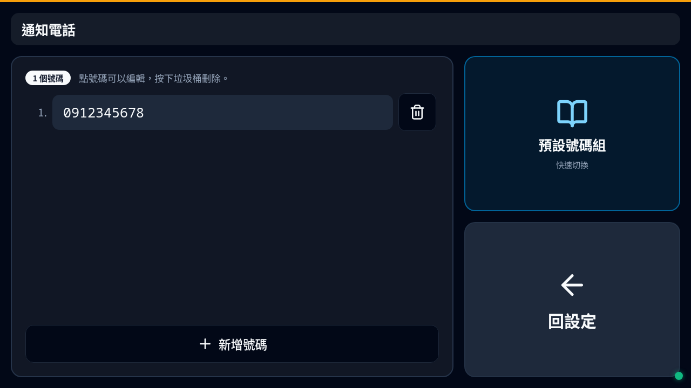

點任何一個號碼即可編輯。垃圾桶圖示刪除。`新增號碼` 加一筆。鍵盤直接從螢幕跳出，不用接實體鍵盤。

號碼是**依清單上的順序**依次撥打。TAS 服務會在註冊的帳戶下撥出**真實電話**，所以**存檔前一定要再看一次號碼**；按鈕按下後不會再跳第二層確認。

#### 預設號碼組

電話頁面右上角的 `預設號碼組` 按鈕可以管理輪班用的號碼預設 — 不同班次可能需要不同的通報電話清單。

- **套用預設**：點選該列，號碼立即載入並回到電話頁面。
- **編輯預設**：點鉛筆圖示。編輯器跟主電話頁面操作方式一樣（新增/刪除/調整號碼）。點上方的預設名稱可以重新命名。
- **刪除預設**：點垃圾桶圖示，對話框確認後刪除。
- **新增預設**：點 `新增預設`，系統自動產生預設名稱，之後可從編輯器改名。

預設存在裝置上，重開機不會消失。套用預設會覆蓋目前的電話清單 — 舊的清單不會自動保存，如果之後還想切回來，請先替它建一組預設。

### 連 WiFi（`網際網路`）

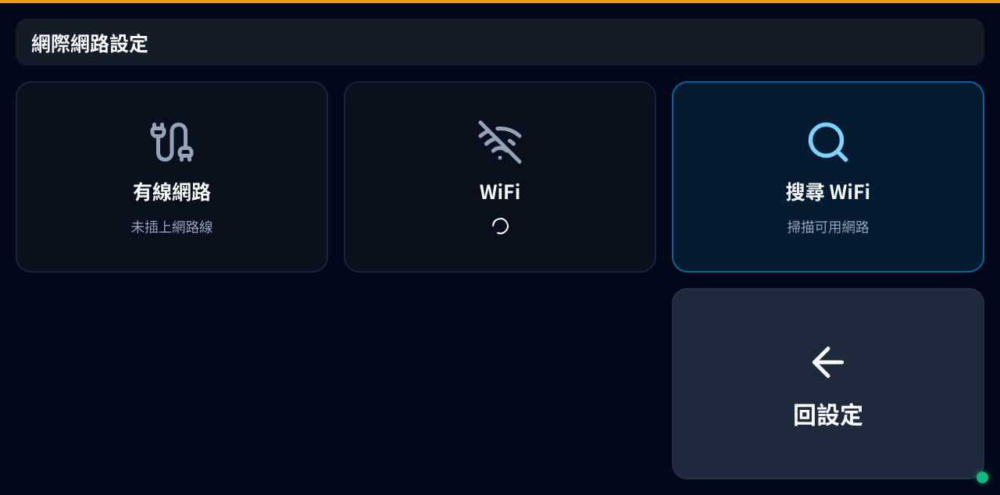

三格磚塊：

- `有線網路` — 顯示乙太網路狀態。`未插上網路線` 表示沒插線；插上之後會自動連線、不需要密碼。
- `WiFi` — 顯示目前的 WiFi 狀態跟 SSID。
- `搜尋 WiFi` — 掃描可用網路。點選清單中的網路、輸入密碼、按 `加入` 即可；機器會記住該網路，重開機後自動連回去。

換 WiFi 路由器或改密碼時，第一件事是進來這裡。機器**不會**自動切回熱點模式，沒連到網路的機器無法撥出緊急電話。

### 配對新按鈕（`Zigbee`）

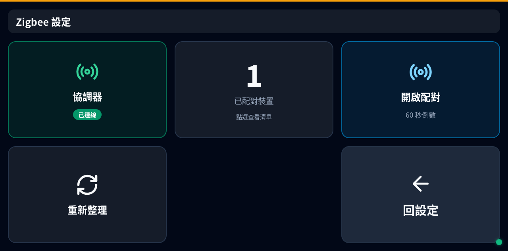

1. 點 `開啟配對` — 機器會開啟 60 秒的配對視窗（畫面會倒數）。
2. 在新按鈕上**長按配對鍵**直到 LED 快速閃爍。（不同型號的按鈕配對動作不一樣，請看按鈕本身的說明卡。）
3. 中間那格 `已配對裝置` 的數字會 +1，新裝置會出現在清單中。點該格可進入查看。
4. 配對失敗時，按 `重新整理` 強制協調器重新掃描已配對裝置 — reset 後常見的恢復步驟。

左邊那格 `協調器 已連線` 是綠色徽章。若是紅色，表示 Zigbee 整個離線、配對絕對不會成功 — 先回主頁，點 `Zigbee 接收` 進入服務細節並重啟。

### 重開 / 關機 / 自我測試（`機器操作`）

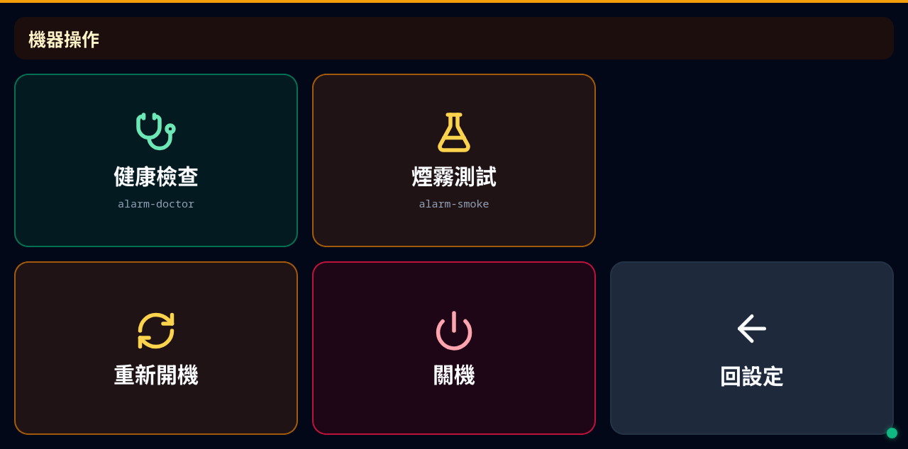

| 磚塊           | 用途                                                                              |
| -------------- | --------------------------------------------------------------------------------- |
| `健康檢查`     | 執行 `alarm-doctor` — 電池 / 配對 / MQTT 三項基本檢查，**不會撥出電話**。         |
| `煙霧測試`     | 點下會跳出對話框讓你選測哪個環節（見下方）。**不是例行項目**，有狀況時才用。      |
| `重新開機`     | 軟重開機。約 45 秒回來。                                                          |
| `關機`         | 關閉電源。機器**不會**自動開回來；要重新啟動請按外殼上的白色橡膠按鈕（或拔/插電源）。 |
| `回設定`       | 返回。                                                                            |

#### `煙霧測試` 的三個選項

點 `煙霧測試` 不會立刻動作，會先跳對話框：

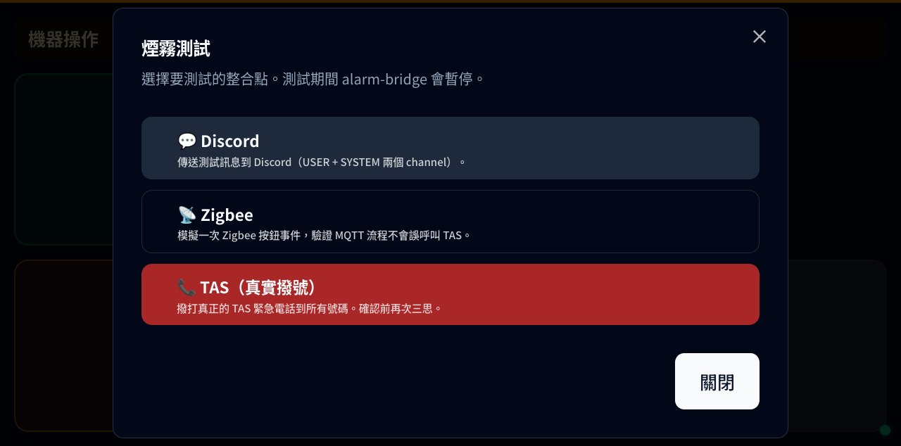

三個目標可選：

- `📞 TAS（真實撥號）` — **撥真實緊急電話到 `通知電話` 清單上所有號碼**。最具破壞性、會花到電話費，按之前先通知所有人。
- `💬 Discord` — 傳送一則測試訊息到 Discord 的 USER + SYSTEM 兩個頻道。不會打電話、不會動 Zigbee。
- `📡 Zigbee` — 模擬一次 Zigbee 按鈕事件，驗證 MQTT 流程沒問題（**不會**觸發到 TAS 撥號）。**執行期間主頁的 `Zigbee 接收` 磚塊會暫時變紅**（如下圖），測試結束後會自動恢復。

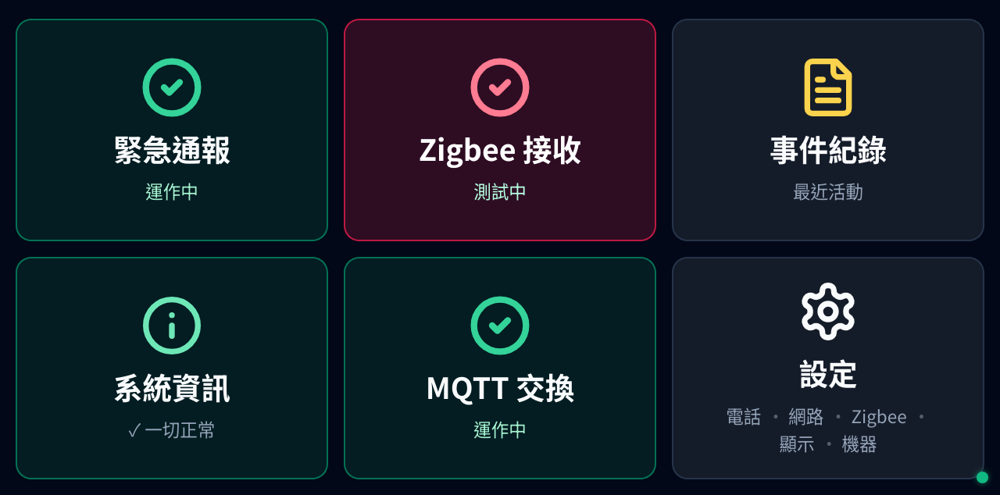

對話框最上面那句 `測試期間 alarm-bridge 會暫停` 是預期行為 — 為了不讓模擬事件意外撥出真實電話，整個測試期間主要的 `緊急通報` 服務會暫停接收訊息，測試結束自動恢復。

`健康檢查` 通過時通常不用再跑這些；煙霧測試是有狀況時的自行排查手段，不是日常檢查。

## 邊框警示燈（Edge Glow）

機器發生事件時，整個螢幕四周會出現彩色光暈，邊看邊也能注意到（不用一直盯著看）。只有兩種：

- **紅光 + 右上紅色三角警示徽章** — 緊急電話剛剛撥出。持續約 15 秒。

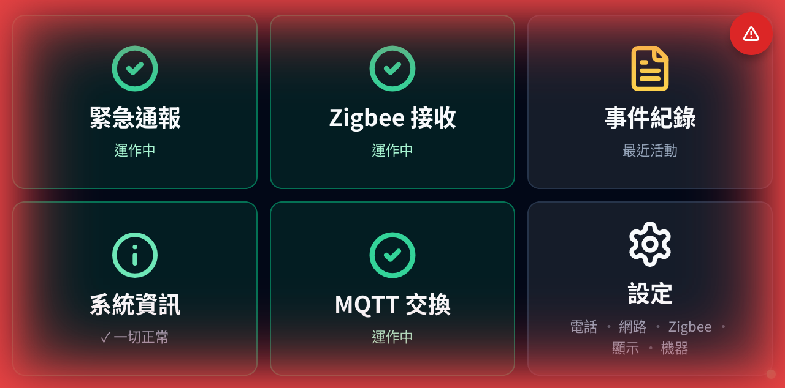

- **綠光 + 右上綠色打勾徽章** — 自我測試按鈕被按到（沒撥電話）。持續約 5 秒。

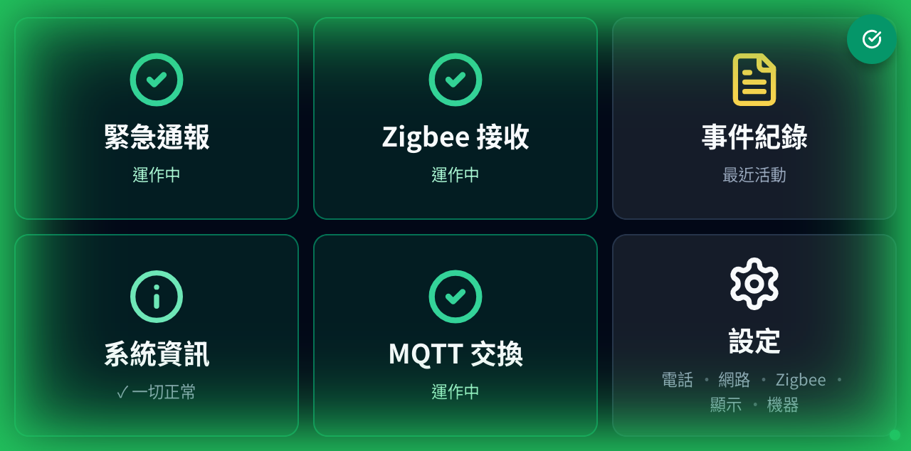

光暈本身只是提示，不需要操作；紅光看到的話表示電話「剛剛」確實有撥（可進 `事件紀錄` 對時間），綠光看到的話表示自我測試的按鍵真的有收到。

高溫警告**不**走邊框光暈；主頁的 `系統資訊` 磚塊在 CPU 超過 65 °C 時會變黃，這就是高溫提示。

## 常見操作流程

### 「剛剛有警報，但我不確定電話有沒有打出去。」

→ 進 `事件紀錄`。找出一筆紅點 `已撥出緊急電話` 緊接在 `急救按鈕被按下` 之後且時間相同 = 電話有撥出。若有「按下」但下一筆不是「撥出」，代表撥號失敗；從主頁進 `緊急通報` 查看最近的日誌。

### 「主頁有一格變紅。」

→ 點那格紅磚塊。看最後幾行日誌。點 `重啟`。等大約 10 秒。磚塊應該會變回綠色。若維持紅色，回報時拍下這個畫面。

### 「Discord 不再顯示心跳。」

→ 進 `系統資訊`，看 `Discord 心跳` 是不是 `已斷線`。先進 `設定` → `網際網路` 確認 WiFi 那格的狀態 — WiFi 沒接好是最常見的原因。若 WiFi 正常但 Discord 還是斷線，從主頁進 `緊急通報` 並按 `重啟`；還是沒回來就需要回報（可能是 Discord 服務本身或路由器擋住 Discord，回報時拍下這個畫面）。

### 「我在做例行檢查。」

每週點 `機器操作` → `健康檢查`，看到全部綠色勾勾就好。`煙霧測試` 不是例行項目 — 有狀況時才針對該環節跑（按鈕沒反應跑 Zigbee 測、Discord 沒訊息跑 Discord 測、整套都要驗的話才跑 TAS）。

## 本說明**不**處理的事

- SSH 進機器、抓系統日誌、`nixos-rebuild` — 不在本說明範圍。
- 改 flake、部署新版本 — 不在本說明範圍。
- 換硬體（SD 卡、DSI 面板）— 不在本說明範圍；若懷疑 SD 卡被偷，請見 `runbook-sd-compromise.md`。

若機器有狀況、本說明裡又沒有對應的磚塊處理方式，請**拍下螢幕並回報**。不要拔 SD 卡、不要反覆斷電開機。
